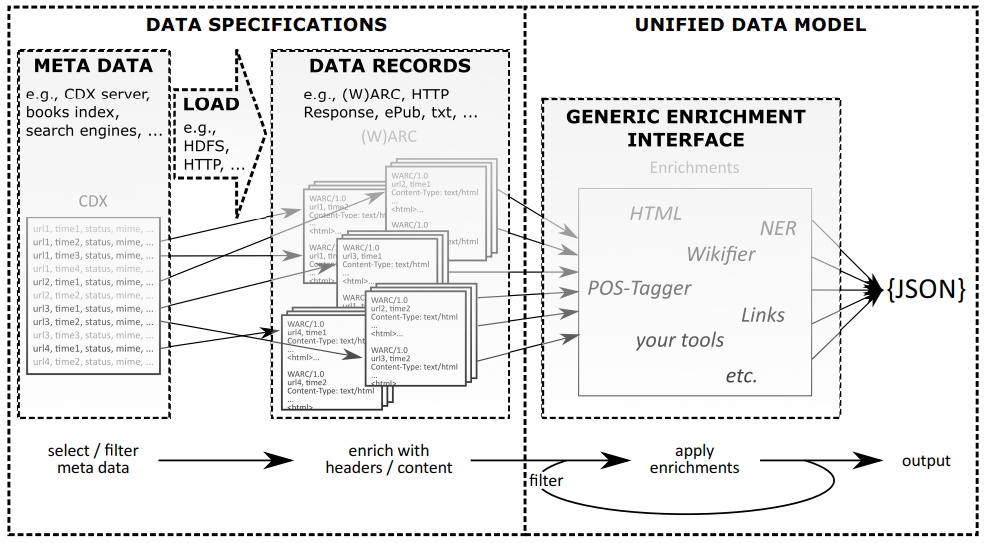

[< Table of Contents](README.md) | [Related Projects >](Related_Projects.md)
:---|---:

# Approach

In the traditional Spark / Map Reduce approach, datasets are loaded fully before irrelevant records are filtered out and relevant ones are transformed into something more valuable by extracting and deriving meaningful information.

In contrast to this, ArchiveSpark incorporates lightweight metadata records about the items in a dataset, which are commonly available for archival collections. Now, basic operations, like filtering, deduplication, grouping, sorting, will be performed on these metadata records, before they get enriched with additional information from the actual data records. Hence, rather than starting from everything and removing unnecessary data, ArchiveSpark starts from metadata that gets extended, leading to significant efficiency improvements in the work with archival collections.:

The original version of ArchiveSpark was developed for web archives, with the metadata coming from CDX (capture index) and the data being stored in (W)ARC files. With the later introduction of _Data Specifications_, ArchiveSpark can now be used with any archival collection that provides metadata records along with the data. 

# Publications

ArchiveSpark is described and published in two research papers, which you should cite when you use ArchiveSpark in your work:

* The first and main paper was the presentation of ArchiveSpark at JCDL 2016 (Best Paper Nominee). It describes the core ideas and includes benchmarks:
  * [H. Holzmann, V. Goel and A. Anand. *ArchiveSpark: Efficient Web Archive Access, Extraction and Derivation*. 16th ACM/IEEE-CS Joint Conference on Digital Libraries (JCDL). Newark, New Jersey, USA. June 2016.](http://dl.acm.org/citation.cfm?id=2910902) [**Get full-text PDF**](http://www.helgeholzmann.de/papers/JCDL_2016_ArchiveSpark.pdf)
* We later presented the extensions to ArchiveSpark to make it a more universal / generic data processing platform for any archival collection at IEEE BigData 2017 (Short Paper):
  * [H. Holzmann, Emily Novak Gustainis and Vinay Goel. *Universal Distant Reading through Metadata Proxies with ArchiveSpark*. 5th IEEE International Conference on Big Data (BigData). Boston, MA, USA. December 2017.](http://cci.drexel.edu/bigdata/bigdata2017/AcceptedPapers.html) [**Get full-text PDF**](http://www.helgeholzmann.de/papers/BIGDATA_2017.pdf)
  
In addition to these publications, ArchiveSpark was used as a major component in the following works:

* In combination with the temporal archive search engine [Tempas](http://tempas.L3S.de/v2), ArchiveSpark was used for a data analysis case starting from keyword queries through [Tempas2ArchiveSpark](https://github.com/helgeho/Tempas2ArchiveSpark):
  * [H. Holzmann, W. Nejdl and A. Anand. *Exploring Web Archives Through Temporal Anchor Texts*. 7th International ACM Conference on Web science (WebSci). Troy, NY, USA. June 2017.](https://dl.acm.org/citation.cfm?id=3091500) [**Get full-text PDF**](http://www.helgeholzmann.de/papers/WEBSCI_2017.pdf)
* ArchiveSpark with [ArchiveSpark2Triples](https://github.com/helgeho/ArchiveSpark2Triples) was used to build a *semantic layer* for web archives in the following publication:
  * [P. Fafalios, H. Holzmann, V. Kasturia and W. Nejdl. *Building and Querying Semantic Layers for Web Archives*. 17th ACM/IEEE-CS Joint Conference on Digital Libraries (JCDL). Toronto, Ontario, Canada. June 2017.](http://ieeexplore.ieee.org/document/7991555) [**Get full-text PDF**](http://www.helgeholzmann.de/papers/JCDL_2017.pdf)

[< Table of Contents](README.md) | [Related Projects >](Related_Projects.md)
:---|---: